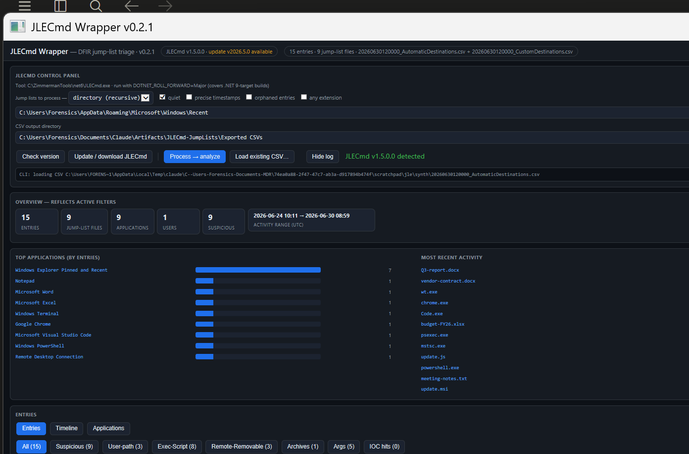
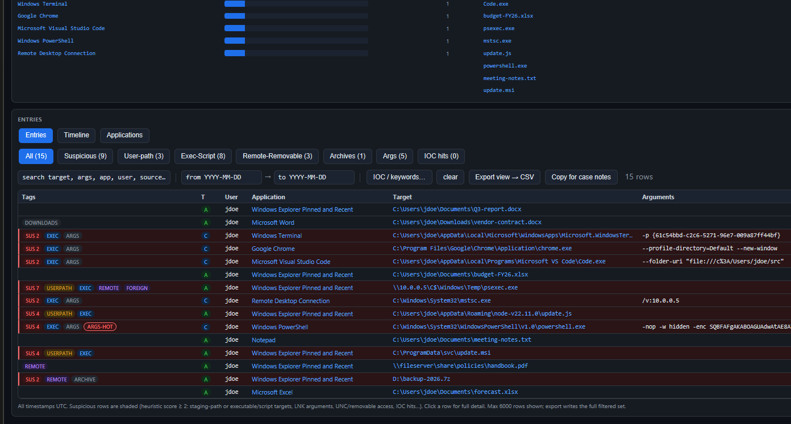
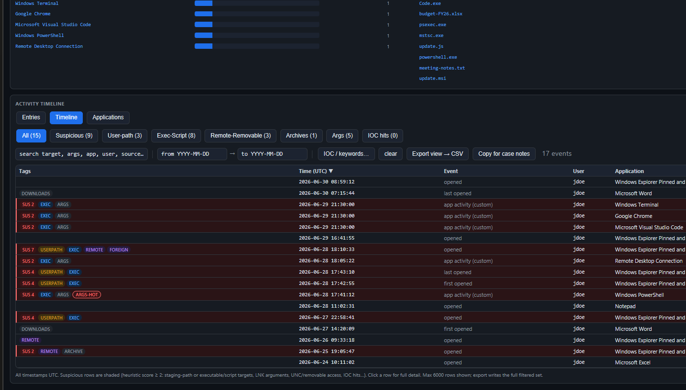
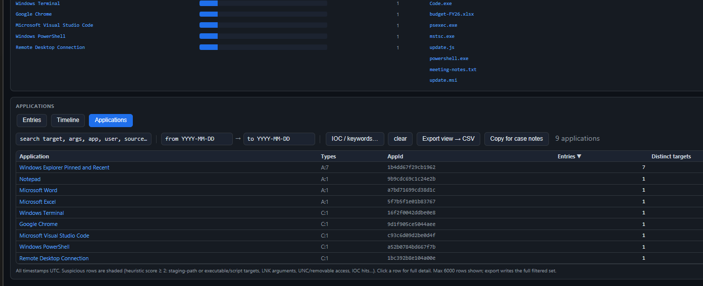

# JLECmd Wrapper

A single-file (`.hta`) GUI for triaging **Windows Jump Lists** with Eric Zimmerman's
[JLECmd](https://github.com/EricZimmerman/JLECmd). It runs JLECmd for you and turns **both** output
CSVs (`AutomaticDestinations` + `CustomDestinations`) into one interactive, suspicion-scored view of
what the interactive user opened, when, and from where — per user profile.

## Screenshots

Overview — stats, top applications, most-recent activity, and score-ranked suspicious targets
(all recomputed over the active filters):



Entries view — one row per destination, suspicion-scored and tagged (staging paths, executable/script
targets, LNK arguments, UNC/removable, foreign tracker host):



Timeline view — first/last-opened events from automatic entries plus per-file activity for custom
jump lists, flattened and sorted:



Applications view — per-AppId rollup with entry counts, distinct targets, and activity range:



> Screenshots use synthetic sample data (fake host `ACME-WS01` / user `jdoe`) — no real case data.

Part of the same wrapper family as
[PECmd-Wrapper](https://github.com/bpmorris22/PECmd-Wrapper),
[AmcacheParser-Wrapper](https://github.com/bpmorris22/AmcacheParser-Wrapper),
[MFTECmd-Wrapper](https://github.com/bpmorris22/MFTECmd-Wrapper),
[SrumECmd-Wrapper](https://github.com/bpmorris22/SrumECmd-Wrapper) and
[SQLECmd-Wrapper](https://github.com/bpmorris22/SQLECmd-Wrapper): same dark viewer, same CLI contract,
same one-click self-update.

## Quick start

1. Double-click `JLECmd-Wrapper.hta` (runs via `mshta`).
2. Put it next to `JLECmd.exe`, or click **Update / download JLECmd** to fetch the latest build.
3. Point the input at:
   - `%APPDATA%\Microsoft\Windows\Recent` — this user's live jump lists (no elevation needed; the
     **Scan this user's Recent** button fills this in). Both `AutomaticDestinations` and
     `CustomDestinations` are picked up in one recursive pass.
   - a collected `Users` tree (KAPE / Velociraptor) — the **User** column is derived per profile.
   - a single `.automaticDestinations-ms` / `.customDestinations-ms` file.
4. Click **Process → analyze**. A console window shows progress; results load automatically.

Or **Load existing CSV…** to view JLECmd CSVs you already have — it detects the type and offers to pair
the matching Automatic/Custom sibling into one dataset.

## Three views

- **Entries** — one row per destination entry (automatic + custom, unified). Click any row for a full
  detail pane: every timestamp, target, volume, tracker MachineID/MAC, MFT entry, and source.
- **Timeline** — one activity event per row: first/last-opened times from automatic entries, plus
  per-file activity for custom jump lists, flattened and sorted.
- **Applications** — one row per AppId (application), rolled up: entry counts, distinct targets, users,
  and first/last activity. Click to filter Entries to that app.

## Suspicion scoring

Each entry gets an additive score; **score ≥ 2** is shaded and tagged suspicious. Heuristics are tuned
for interactive-attacker behavior:

| Tag | Meaning |
|---|---|
| `USERPATH` | Target/working-dir under a staging path (`\AppData\`, `\Temp\`, `\ProgramData\`, `\Public\`, `\$Recycle.Bin\`…) |
| `DOWNLOADS` | Target under a Downloads folder |
| `EXEC` | Executable/script target (exe, dll, ps1, bat, vbs, js, hta, scr, msi, jar, lnk…) |
| `ARGS` / `ARGS-HOT` | LNK carries arguments / arguments contain a hot token (`-enc`, `powershell`, `iex`, `mshta`, `http`, UNC…) |
| `REMOTE` | Removable-media or UNC target (+ admin share `\\host\C$`) |
| `ARCHIVE` | Archive/container target (zip, rar, 7z, iso, vhd…) |
| `FOREIGN` | Tracker MachineID differs from the dataset's home host |
| `IOC` | Matches a term in your IOC / keyword list |
| `UNKNOWN-APP` | Blank AppId description on an already-flagged entry |

Legitimate per-user install roots (`\AppData\Local\Programs\`, Store `WindowsApps`, Teams, Start-Menu
shortcuts) are excluded from `USERPATH` so real per-user apps don't drown out attacker staging in
`\AppData\Roaming\<vendor>\` and `\AppData\Local\Temp\`.

Paste an **IOC / keyword** list (comma or newline separated, or load a `.txt`) to score matches +3 and
highlight them in the detail pane.

## Grid

Columns are **resizable** — drag a header's right edge; double-click the edge to reset. Widths are
remembered per view in a `JLECmd-Wrapper.settings.json` sidecar next to the app. Every column sorts;
free-text search, a per-user filter, a UTC date range, and one-click category filters narrow the set,
and the filtered view exports to CSV or copies as case notes.

## Command line

```
mshta "JLECmd-Wrapper.hta" "<inputOrCsv>" ["<outDir>"] [/auto] [/view:entries|time|apps]
```

- `<input>` — a `.csv` (auto-loads into the viewer, pairing the Automatic/Custom sibling automatically)
  or a jump-list file / directory (prefilled; processed immediately with `/auto`).
- `<outDir>` — CSV output directory (optional). &nbsp; `/view:` — open directly on a specific view.

## Notes

- All timestamps are **UTC**.
- `Empty custom destinations jump list` skips during a run are **routine**, not errors — they are
  reported as a count.
- Reading another user's profile jump lists from a live machine needs an **elevated** run.
- JLECmd (like the other EZ console tools) needs a real console window; the wrapper always runs it in one.

## Requirements

- Windows with `mshta` (built in).
- JLECmd (net6/net9 build). Use **Update / download JLECmd** or drop `JLECmd.exe` next to the `.hta`.
- .NET runtime as required by the JLECmd build (the runner sets `DOTNET_ROLL_FORWARD=Major`).

## License

MIT © 2026 Ben Morris.
